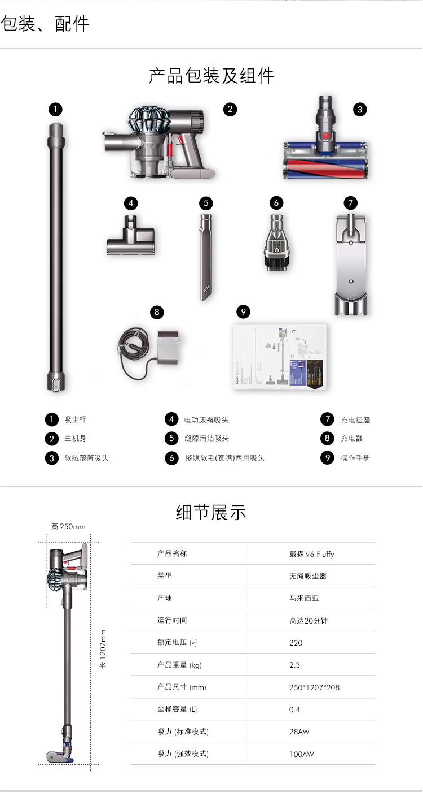
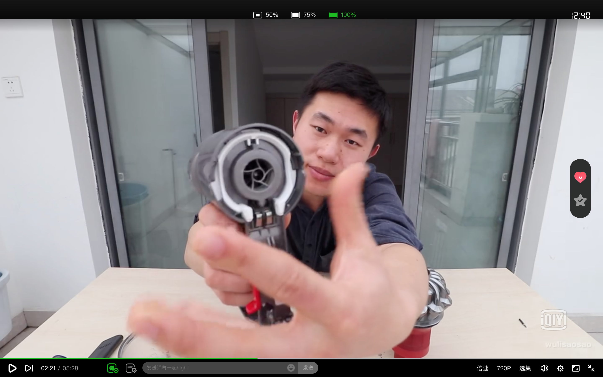
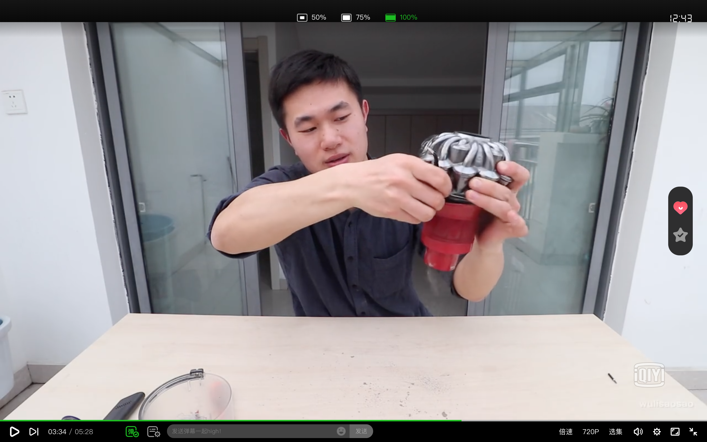
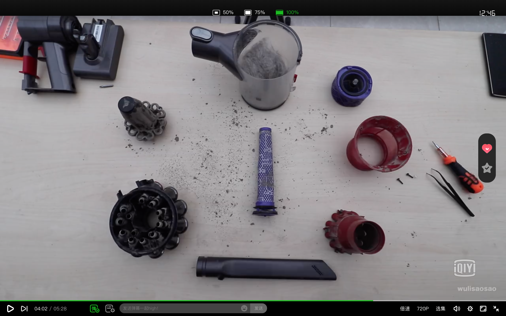

# 如何拆解和清理戴森吸尘器V6

今天过年大扫除, 用了封箱多年的戴森吸尘器打扫地毯. 打扫后习惯性的清理里面的灰尘.但是发现滤网里的灰尘已经结块倒不出来了.就上网找清理这款v6吸尘器的教程.

找到了一个不错的视频教程: https://www.iqiyi.com/w_19rxcn3rgp.html

吸口, 尘筒都很容易拆开. 电机和滤网的拆除就费劲了, 中间有一个卡扣.需要两边同时向里压一下再拔一下才能拆开.

还有就是滤网也是一个卡扣固定的, 视频教程里的这位小哥用了一个镊子从中间插进去, 顺时针转一下, 再逆时针转一下就把滤网取下来了.

拆完就是这么几个东西, 清洗晾干后再组装起来就好了.

[关于作者](https://about.me/qyf404)
