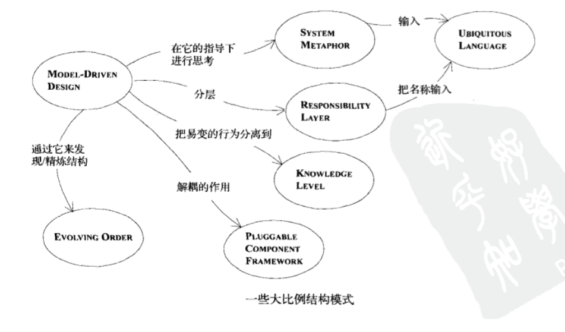
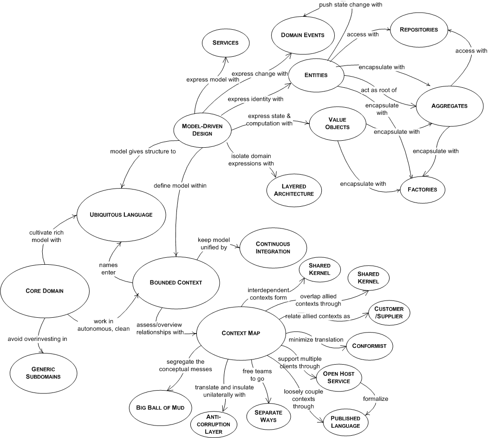

# 读<<领域驱动设计-软件核心复杂性应对之道>>有感

---

> 道可道,非常道.
> 
> 名可名,非常名.
> 
> 无名天地之始,有名万物之母.
> 
> ---老子

# 关于标题

好久没写东西了,动笔的动机是看完了一本书,想写点总结性的东西,一是为了回顾一下梳理知识点,二是为了日后遗忘时能有个简短的文章帮助自己快速回忆.

标题看着像上学时写的作文题目,原本想找个高大上的题目好拉拉人气,但关于领域驱动设计我也才处在`守破离`的`守`得级别,还是老老实实用个规矩的标题吧.

# 核心内容

作者在书中反复强调领域通用语言(Ubiquitous Language)的重要性,依据领域通用语言剥离出核心领域(Core Domain),随着业务的发展和技术人员对领域知识的学习,不断的调整领域通用语言,从而提炼核心领域.在这个闭环中,有这么几点很重要:

* 沟通
	
	项目组的成员要保证沟通的态度和效率.大家(包括并不限于开发,测试,需求,客户)愿意围绕业务知识进行沟通.有效的沟通能够得出领域通用语言,反馈认知的偏差,编写更接近自然语言的代码.
	
* 重构

	项目组的成员要勇于挑战,勇于纠错,勇于提炼核心领域知识.只有这样才能够让核心领域更精炼,普通子域(Generic Subdomain)更内聚,让有界上下文(Bounded Context)的边界更清晰.让众神归位各司其职.
	
* 一些模式和设计技巧

	这是一本写设计的书,但是作者是站在一个类似项目经理的角度写的,其关注的重点不在于算法和数据结构的精妙,而是项目的整体.所以沟通和重构很重要,所有的这些技术相关的模式也多数为项目的推进而服务.目的是让技术人员写出谁都能看懂的代码,写出扩展性更好的代码,写出更接近自然语言的代码,写出能够自解释的代码.
	
总结一下,核心内容就是有效的组织协调人,有效的组织协调代码,最终成功完成项目.	
	
# 梳理知识点


不管怎样作者给出了很多模式,有代码级别的,作者叫模型驱动设计的构造块.有管理级别的,作者叫战略设计.给出的概念更是一堆一堆的.老子说的好,"非常道,非常名",能阐述出来的都不是永恒不变的,但有效的沟通需要我们建立在很多理解一致的概念上,让我们挨个梳理一下作者的概念吧.

## 领域通用语言(Ubiquitous Language)

这个概念我也是第一次看到,作者在整个书中时不时要提一下这个概念.其实领域通用语言主要解决的是沟通问题,主要是业务人员和技术人员的沟通问题.不然开会的时候业务人员说自己的,技术人员说自己的,然后还谁都看谁不爽.

其实,这个东西还是让技术人员妥协了,因为组成领域通用语言的以领域知识的概念为主.当然这也是必然的,除了一些技术性很强的项目(比如搞个云平台),多数项目的目的都是为了服务于业务,帮助公司业务部门为公司创造更多的利润.完成技术人员学习领域知识的过程作者称之为消化知识.

## 模型驱动设计(Model-Driven Design)

10年听说了TDD,其目的是让每一个功能有一个明确的完成界限.这回又听一个新东西MDD.模型驱动设计其实就是从模型开始出发,将领域通用语言中的概念映射到代码上,这样可以让代码直接体现出领域知识.让技术人员和业务人员的沟通在一件事情上,如果没有这层映射,他们的沟通必然存在转换.

其实这里作者是反对根据功能点开发的流程的.比如很多项目的业务模型体现在数据库上,而一个http请求过来后,顺序的调用 control,service,dao最终在数据库中体现模型内容的变化.作者更期望的是一种面向语义化得开发.

比如一个用户加另一个用户好友,前面那一种的代码可能是这样的:

```java

interface UserService{
	void addFriend(User user1, User user2);
}
```

到底是user1加user2好友,还是user2加user1好友,调用该接口的程序员必须去看实现,要不就是实现的程序员要把实现细节在接口上的注释里写明白.

而后面那种设计的代码可能是这样的:

```java
interface User{
	void addFriend(User user);
}
```

代码的自解释在这里体现了出来.

模型驱动设计将很多具体实现都交给了模型来完成,让计算更接近数据.

## 手工建模(Hands-On Modeler)

还是为了解决信息传递,建模人员必须参与开发,防止模型图没有很好的传递设计意图和设计细节.一定要用代码体现出模型.要做能编码的设计师.

## 分层架构(Layered Archiecture)

分层在领域驱动开发中也是有用武之地的,分层可以隔离各个子领域,能够让模型更内聚.作者给出了一个分层建议:

```
-----------------------------------
用户界面层(或表示层)
-----------------------------------
应用层
-----------------------------------
领域层(或模型层)
-----------------------------------
基础设施层
-----------------------------------
```

## 智能用户界面"反模式"(The Smart UI "Anti-Pattern")

这是一个和领域驱动设计相反的设计方法,其主要特点就是展现层直接和数据库交互.

优点是可以快速完成功能开发.

缺点是可维护性较差.

## 实体(Entity)

有唯一ID,能够反映领域模型.最重要的是要有业务逻辑.

## 值对象(Value Object)

没有唯一ID,能够反映领域模型,也要有业务逻辑.与实体最大的区别是两个相同对象比较时的逻辑,两个实体只要ID相同,我们就认为他们指向了同一个对象;而值对象只要所有属性相同,我们就认为指向了同一个对象.

## 服务(Service)

好的Service有如下三个特征:

1. 与领域概念相关的操作不是ENTITY或VALUE OBJECT的一个自然的部分.
2. 接口是根据模型的其他元素定义的.
3. 操作是无状态的.

## 模块(Module)

`高内聚低耦合`是软件设计的一条原则.用作者的话说:一个人一次考虑的事情是有限的,因此才有低耦合.不连贯的思想和一锅粥似的思想同样难于理解,因此才有高内聚.

划分模块就是遵循该原则,每个模块包含一个内聚的概念集合.并尽可能把实现单一概念对象的所有代码放到同一个模块中.

## 聚合(Aggregate)

聚合主要用来封装对象的内部结构.其作用就是将关联的对象聚合在一起,由一个对象对外暴露遍历接口.这样能够降低对这组关联对象的维护的复杂度.每个聚合都要有一个根(root)和一个边界(boundary).

为了实现概念上的聚合根,需要对所有事物应用一组规则.

1. 根实体具有全局标识,它最终负责检查固定规则.
2. 根实体具有全局标识.边界内的实体具有本地标识,这些标识只有在聚合根内部才唯一.
3. 聚合外部的对象不能引用除根实体之外的任何内部对象.根实体可以把对内部实体的引用传递给它们,但这些对象只能临时使用这些引用,而不能保持引用.根可以把值对象的副本传递给另一个对象,而不必关心它发生什么变化,因为它只是一个值对象,不再与聚合根有任何关联.
4. 作为上一条规则的推论,只有聚合的根才能直接通过数据库查询获取.所有其他对象必须通过关联的遍历才能找到.
5. 聚合内部的对象可以保持对其他聚合根的引用.
6. 删除操作必须一次删除聚合之内的全部对象.
7. 当提交对聚合边界内部的任何对象的修改时,整个聚合中的所有固定规则都必须被满足.

## 工厂(Factory)

工厂用来创建和重建复杂对象.对象的构造方法原本就可以完成对象的创建,但是如果对象比较复杂,创建方法就会和对象的行为方法混在一起,这时就不如将对象的创建逻辑放到工厂中来完成.这样就讲对象创建的逻辑抽离出来,而对象去关系自己的业务逻辑.

好的工厂都需要满足如下两个基本需求:

1. 每个创建方法都是原子方法,而且满足被创建对象或聚合的所有固定规则.工厂应该以一致的状态来生成对象.如果工厂通过其接口收到了一个创建对象的请求,而它又无法正确地创建出对象,那么它应该抛出一个异常,或者调用某种其他机制,以确保不会返回错误的值.
2. 工厂应该被抽离为所需的类型,而不是创建出具体的类.

没必要让多有类的创建都用工厂,不复杂或客户关系实现的可以直接用构造方法.

## 资源库(Repository)

将所有对象存储和访问操作交给资源库来完成,而对于聚合一定控制只能从聚合根开始访问遍历.

使用资源库有很多好处:

1. 它们为客户提供了一个简单的模型,可以来获取持久对象并管理它们的生命周期.
2. 它们使应用程序与持久化技术解耦.
3. 它们体现了有关对象访问的设计决策.
4. 可以很容易将它们替换为"哑实现",以便在测试中使用.

## 释意接口(Intention-Revealing Interfaces)

这个模式其实主要解决的还是沟通问题.强调要面向接口设计,而且接口及参数的命名一定要表达出意思来,这样调用者不会迷糊.还是那句话,写出人能看懂的代码.

## 无副作用函数(Side-Effect-Free Function)

这个模式强调一些值对象的操作一定是无副作用的.所谓无副作用就是,一个地方调用该方法,不会导致其他引用该对象的地方调用该方法得到不同的结果.作者用颜色这个值对象做了示范,其实Java中的BigDecimal里的运算方法都是无副作用的.


## 断言(Assertion)

对于这章的内容,我的理解是针对无副作用的函数增加单元测试,用于保障函数无歧义.作者也说了如果语言支持断言,可以直接在程序中增加断言.Java有个关键字assert可以来做断言,但是这个关键字要生效需要启动程序是增加JVM参数`-ea`,多数情况下Java除测试的程序外很少使用.

## 概念轮廓(Conceptual Contour)

这个模式就是让相关的操作,类,接口,聚合 放到一起,使其更内聚,让其内部更加稳定.

## 独立类(Standalone Class)

这个模式强调低耦合,防止对象互相依赖,要讲对象无关的操作放到对象外.让理解对象更容易.

## 闭合操作(Closure of Operation)

所谓闭合操作,就是方法的返回值和参数类型相同,而且一般闭合操作的都是值对象.

## 声明式设计

其实这章作者描述的就是语义化编程,让程序编写更接近自然语言,让程序能够自解释.比如下面这段代码

```java
Specification ventilatedType1 = new ContainerSpecification(VENTILATED_TYPE_1);
Specification ventilatedType2 = new ContainerSpecification(VENTILATED_TYPE_2);

Specification either = ventilatedType1.or(ventilatedType2);
```

## 策略模式(Strategy 也称Policy)

虽然标题叫策略模式,其实作者是想表达过去的很多设计模式也很适合领域设计.比如策略模式,能够很好的将对象的多态表述出来.

## 组合模式(Composite)

作者介绍了组合模式在领域设计中的使用,拿航线做了示例.

## 战略设计


战略设计在我看来更多的是规划开发.通过一些模式或方法来确定工作重心,并将资源花在核心上.

(战略设计很多名称译者也没给出中文名,我也没找到中文译名,就直接用英文了)

## Bounded Context


这个模式就是告诉我们一定要划清模型边界,在不同的模型中有不同的上下文,而这些领域知识仅限于当前的上下文,而模型的边界很重要,边界清晰,能够降低沟通成本,而且能够很好的安排工作.

## 持续集成(Continuous Integration)

如果模块划分的多,或者团队大,及时边界划分的清晰,沟通成本也是很高的.而集成成本也就体现出来了,尽早的集成能够跟早的发现问题.而集成不仅有代码的集成,还有概念的集成.

多数集成有如下特征:

* 分步集成,采用可重复使用的合并/构建技术.
* 自动测试工具.
* 概念集成.
* 在讨论模型和应用程序时坚持使用通用语言.


## Context Map

模块要划清边界,但是模块间要互相调用和通信的,这就需要有一个 Context Map 来对模块间的对象进行相互转换.

## Shared Kernel

为解决Context Map,最简单的办法就是共享核心,这样就不存在模型间的转换了.但前提是能够共享,而且有专人在维护这个核心.

## Customer/Supplier

如果两个模块间存在上下游关系,而且下游有更大的决策权,那么这种Customer/Supplier模式就比较适合.

这个模式有两个关键要素:

1. 关系必须是客户与供应商的关系,其中客户需求是至关重要的,由于下游团队并不是唯一的客户,因此不同客户的要求必须通过协商类平衡,但这些要求都是非常重要的.这种关系与通常出现的`穷亲戚`关系相反,在后者下游团队不得不祈求上游团队满足其需求.
2. 必须有一个自动化测试工具,使上游团队在修改代码时,不必担心破坏下游团队的工作,并能够使下游团队能够专注于自己的工作,而不用总是密切注意着上游的行动.

作者用接力赛来比喻这个模式,接棒的人要相信上一棒能准确的传到自己手里.

## Conformist

> 当两个开发团队具有上下游关系时,如果上游团队没有动机来满足下游团队的需求,那么下游团队将无能为力.处于利他主义的考虑,上游开发人员可能会做出承诺,但他们可能不会履行承诺.下游团队处于良好的意愿会相信这些承诺,从而根据一些永远不会实现的特性来制定计划.下游项目只能被搁置,直到团队最终学会利用现有条件自力更生为止.下游团队不会得到根据他们的需求而量身定做的接口.

这是一个现实存在的问题,团队间沟通总是存在障碍,尤其上游的KPI内容和服务下游无关时.作者告诉我们如果下游是弱势,最简单和省时间的方式就是成为追随者,顺着上游的接口开发.

## Anticorruption Layer

如果追随者发现,如果顺着上游的接口开发会破坏自己模型结构,或者让自己的模型混乱时.那就请使用`Anticorruption Layer`.创建一个隔离层,这个层通过现有接口与另一个系统进行通信.而且适配器模式(Adapter)和外观模式(Facade)能很好的完成这个隔离层架构.创建隔离层还有个好处就是外部接口发现变化后,只需要修改隔离层代码就好,不会影响到核心代码.

## Separate Way

作者说这是个模式,好吧,这是个模式,这个模式告诉我们:如果集成的性价比不高,那就不要集成,下游独立开发自己需要的功能.

## Open Host Service

读完这节让我想到了几年前吵得火热的面向服务编程,也有点像现在的微服务框架.就是说上游将自己的服务标准化,提供统一的协议和稳定的接口.这样下游团队只需要根据上游团队提供的文档就能够集成.

## Published Language

这个公共语言其实就是说,如果我们开发的软件已经有一套行业标准术语了,那就直接拿来作为我们的通用语言就好,没必要再自定义一套.

## 精炼


我感觉精炼的目的就是梳理业务,让核心,核心起来来.

领域模型的战略精炼包括以下部分:

1. 帮助所有团队成员掌握系统的总体设计及协调.
2. 找到一个具有湿度规模的核心模型并把它天津到通用语言中,从而促进沟通.
3. 指导重构.
4. 专注于模型中最有价值的那部分.
5. 知道外包,现成组件的使用以及任务委派.

## Core Domain

> 一个严峻的现实是我们不可能对又有设计进行同等的精化,而是必须分出优先级.为了使领域模型成为有价值的资产,必须整齐地梳理出模型的真正核心,并完全根据这个核心来创建应用程序的功能.但本来就稀缺的高水平开发人员往往会把工作重点放在技术基础设施上,或者支取解决那些不需要专门领域知识就能解决的领域问题.
> 
> 因此,对模型进行提炼.找到Core Domain 并提供一种易于区分的方法把它与那些起辅助作用的模型和代码分开.最有价值和最专业的概念要轮廓分明.尽量压缩Core Domain.
> 
> 让最有才能的人来开发Core Domain ,并相应地招募新人来补充这些人空出来的位置.在Core Domain中努力开发能够确保实现系统蓝图的深层模型和柔性设计.仔细判断任何其他不得投入,看它是否能够支持这个提炼出来的Core.

一句话,好钢用在刀刃上.

找到重要的是什么,让重要的事重要起来,投入资源在重要的事上.

## Generic Subdomain

除了核心领域外,一些辅助的子领域也要抽离出来,虽然子领域不是最重要的,但是确是整个软件需要的.对于子领域的开发方式也可以有多种选择:

1. 现成的解决方案

	有时可以购买一个已实现的解决方案,或使用开源代码.
	
	优点
	
	* 可以减少代码的开发.
	* 维护负担转移到外部.
	* 代码已经在很多地方使用过,可能较为成熟,因此比自己开发的代码更可靠和完备.

	缺点
	
	* 在使用之前,仍需要花时间来评估和理解它.
	* 就业内目前的质量控制水平而言,无法保证它的正确性和稳定性.
	* 它可能设计的过于细致了(远远超出了你的目的), 集成的工作量可能比开发一个最小化的内容实现更大.
	* 外部元素的集成常常不顺利.它可能有一个与你的项目完全不同的Bounded Context.即使不是这样,它也很难顺利的引入你的其他软件包中的Entity.
	* 它可能会引入平台,编译器版本依赖.

2. 公开发布的设计或模型

	优点
	
	* 比自己开发的模型更为成熟,并且反映了很多人的深层知识.
	* 提供了随时可用的高质量文档.

	缺点
	
	* 可能不是很符合你的需要,或者设计得过于细致了(远远超出了你的需要).

3. 把实现外包出去

	优点
	
	* 使核心团队可以脱身去处理Core Domain,这是需要知识和经验积累的部分.
	* 开发工作的增加不会使团队规模无限扩大下去,同时又不会导致Core Domain知识的分散.
	* 强制团队采用面向接口设计,并且有助于保持子领域的通用性,因为规格已经被传递到外部.

	缺点
	
	* 仍需要核心团队花费一些时间,因为他们需要与外包人员商量接口,编码标准和其他重要方面.
	* 当把代码的所属权交回团队时,团队需要耗费大量精力来理解这些代码.(但是这个开销比理解专用子领域要小一些,因此通用子领域不需要理解专门的背景知识.)
	* 代码质量或高或低,这取决于两个团队能力的高低.

	自动化测试在外包中可能起到重要作用.需要邀请外包人员为他们的交付的代码提供单元测试.
	
4. 内部实现

	优点
	
	* 易于集成
	* 只开发自己需要的,不做多余的工作.
	* 可以临时把工作分包出去.

	缺点
	
	* 需要承受后续的维护和培训负担.
	* 很容易低估开发这些软件包所需要的时间和成本.

## Domain Vision Statement

这一节将的有点像目标管理.领导者需要在核心领域确定前,找好项目目标,也就是项目的核心价值,这有助于我们的工作不会偏离方向.

> 写一份Core Domain的简短描述以及它将会创造的价值(大约一页纸),也就是"价值主张".那些不能将你的领域模型与其他领域模型区分开的方面就不要写了.展示出领域模型是如何实现和均衡各方利益的.这份描述要尽量精简.尽早把它写出来,等到获得新的理解后再修改它.

## Highlighted Core

让重要的重要起来.为了强调核心领域,作者给了个方法,就是写一个精炼文档(3~7页,每页内容不必太多),用于描述核心领域和核心元素之间的主要交互过程.

写这个文档同时会出现这些风险:

1. 文档可能得不到维护.
2. 文档可能没人阅读.
3. 由于有多个信息来源,文档可能达不到简化复杂性的目的.

但是没关系,有了它才能让整个团队有一个明确的目标.就像茫茫大海中的灯塔.

## Cohesive Mechanism

> 计算有时会非常复杂,使设计开始变得膨胀.机械性的"如何做"大量增加,而把概念性的"做什么"完全掩盖.为了解决问题提供算法的大量方法掩盖了那些用于表达问题的方法.
> 
> 因此,把概念上的Cohesive Mechanism(内聚机制)分离到一个单独的轻量级框架中.要特别注意公式算法或那些有完备文档的算法.用一个Intention-Revealing Interface来公开这个框架的功能.现在,领域中的其他元素就可以只专注于如何表达问题(做什么)了,而把解决方案的复杂细节(如何做)转移给了框架.

还是那句话:写出自解释的代码.

## Segregated Core

> 模型中的元素可能有一部分属于Core Domain, 而另一部分起支持作用.核心元素可能与一般元素紧密耦合在一起.Core的概念内聚性可能不是很强,看上去也不明显.这种混乱性和耦合关系抑制了Core的分离.设计人员如果无法清晰地看到最重要的关系,就会开发出一个脆弱的设计.
> 
> 因此,对模型进行重构,把核心概念从支持性元素(包括定义得不清楚的那些元素)中分离出来,并增强Core的内聚性,同时减少它与其他代码的耦合.把所有通用元素或支持性元素提取到其他对象中,并把这些对象放到其他的包中－即使这会把一些紧密耦合的元素分开.

通过重构得到Segregated Core的一般步骤如下:

1. 识别出一个核心子领域(可能是从精炼文档中得到的).
2. 把相关的类移到新的模块中,并根据与这些类有关的概念为模块命名.
3. 对代码进行重构,把那些不直接表示概念的数据和功能分离出来.把分离出来的元素放到其他包的类(可以是新的类)中.尽量把它们与概念上相关的任务放到一起,但不要为了追求完美而浪费太长时间.把注意力放在提炼核心子领域上,并且使核心子领域对其他包的引用变得更明显且易于理解.
4. 对新的Segregated Core Module 进行重构,使其中的核心子领域对其他包的引用变得更明显且易于理解.
5. 对新的Segregated Core Module 进行重构,使其中的关系和交互变得更简单,表达更清楚,并且最大限度的减少并澄清它与其他模块的关系(这是后续重构的目标).
6. 对另一个核心子领域重复这个过程,直到完成Segregated Core 的工作.


## Abstract Core

> 当不同模块的子领域之间有大量交互时,要么需要在模块之间创建很多引用(在很大程度上抵消了划分模块的价值),要么就必须间接的实现这些交互,而后者会使模型变得晦涩难懂.
> 
> 因此,把模型中最基本的概念识别出来,并分离到不同的类,抽象类或接口中.设计这个抽象模型,使之能够表达出重要组件之间的大部分交互.把这个完整的抽象模型放到它自己的模块中,而专用的详细的实现类则留在由子领域定义的模块中.

作者还强调:尽管任何一次突破都会得到一个有价值的深层次模型,但只有Core Domain中的突破才能改变整个项目的轨道.

## 大比例机构



大比例结构这部分内容我就看得晕晕乎乎,不能明确的表述作者所云了,隐隐感觉作者就是在强调模块的职责要划清.的确,很多时候模块间的功能和作用是相互纠缠在一起的.

由于自己也没有很好的理解作者所述,就摘抄一些内容了.

## Evolving Order

> 应该允许这种概念上的大比例结构随着应用程序一起演变,甚至可以变成一种完全不同的结构风格.有些设计决策和模型决策必须在掌握了详细知识之后才能确定,这样的决策不必过早地指定.
> 
> 当发现一种大比例结构可以明显使系统变得更清晰,而又没有为模型开发施加一些不自然的约束时,就应该采用这种结构.使用不合适的结构还不如不使用它,因此最好不要为了追求设计的完整性而勉强去使用一种结构,而应该找到能够最精简地解决所出现问题的方案.要记住宁缺毋滥的原则.

## System Metaphor

> 软件设计往往非常抽象且难于掌握.开发人员和用户都需要一些切实可行的方式来理解系统,并共享系统的一个整体视图.
> 
> 因此,当系统的一个具体类比正好符合团队成员对系统的想象,并且能够引导他们向着一个有用的方向进行思考时,就应该把这个类比用作一种大比例结构.围绕这个隐喻来组织设计,并把它吸收到统一语言中.System Metaphor应该能促进系统的交流,又能指导系统的开发.它可以增加系统不同部分之间的一致性,甚至可以跨越不同的有界上下文.但所有隐喻都不是完全精确的,因此应不断检查隐喻是否过度或不恰当,当发现它起到妨碍作用时,要随时准备放弃它.

## Responsibility Layer

> 如果每个对象的职责都是手工分配的,将没有统一的指导原则和一致性,也无法把领域作为一个整体来处理.为了保持大模型的一致,有必要在职责分配上实施一定的结构化控制.
> 
> 因此,注意观察模型中的概念依赖性,以及领域中不同部分的变化频率和变化原因.如果在领域中发现了自然的层次结构,就把它们转换为主要的抽象职责.这些职责应该描述了系统的高级目的和设计.对模型进行重构,使得每个领域对象 聚合和模型的职责都清晰地位于一个职责层当中.

## Knowledge Level

> 如果在一个应用程序中,实体的角色和它们之间的关系在不同的情况下有很大变化,那么复杂性会显著增加.在这种情况下,无论是一般的模型还是高度定制的模型,都无法满足用户的需求.为了兼顾各种不同的情形,对象需要引用其他的类型,或者需要具备一些在不同情况下包括不同使用方式的属性.具有相同数据和行为的类可能会大量增加,而这些类的唯一作用只是为了满足不同的组装规则.
> 
> 因此,创建一组不同的对象,用它们来描述和约束基本模型的结构和行为.把这些对象分为两个"级别",一个是非常具体的级别,另一个级别则提供了一些可供用户或超级用户定制的规则和知识.

## Pluggable Component

> 当很多应用程序需要进行互操作时,如果所有应用程序都基于相同的一些抽象,但它们是独立设计的,那么在多个有界上下文之间的转换会限制它们的集成.各个团队之间如果不能紧密地协作,就无法形成一个 Shared Kernel.重复和分裂将会增加开发和安装的成本,而且互操作会变得很难实现.
> 
> 因此,从接口和交互中提炼出一个Abstract Core,并创建一个框架,这个框架要允许这些接口的各种不同实现被自由替换.同样,无论是什么应用程序.只要它严格地通过Abstract Core的接口进行操作,那么就可以允许它使用这些组件.

# 写在最后



实践是检验真理的唯一标准.再好的理论只有用起来才有价值,等到熟练了,就可以尝试着去突破作者画的圈圈.

>看山是山，看水是水；
>
>看山不是山，看水不是水；
>
>看山还是山，看水还是水。 
>
>--某个和尚

---

# 参考

* [<<领域驱动设计:软件核心复杂性应对这道>>](https://www.amazon.cn/gp/product/B01GZ6T12K/ref=as_li_tf_tl?ie=UTF8&camp=536&creative=3200&creativeASIN=B01GZ6T12K&linkCode=as2&tag=qyf404-23)
* [<<实现领域驱动设计>>](https://www.amazon.cn/gp/product/B00IYTVWA6/ref=as_li_qf_sp_asin_tl?ie=UTF8&camp=536&creative=3200&creativeASIN=B00IYTVWA6&linkCode=as2&tag=qyf404-23)

