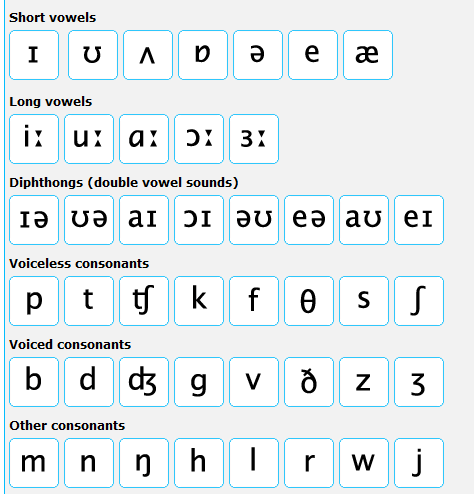

[](学习音标)

# 元音(20个)

## 单元音(12个)

### 长元音(5个)
/i:/ /ɜ:/ /ɑ:/ /ɔ:/ /u:/

### 短元音(7个)
/ɪ/ /e/ /æ/ /ʌ/ /ɒ/ /ʊ/ /ə/

## 双元音(8个)
/eɪ/ /aɪ/ /ɔɪ/ /əʊ/ /aʊ/ /ɪə/ /eə/ /ʊə/

# 辅音(28个)

## 清辅音(11个)
/p/ /t/ /k/ /f/ /θ/ /s/ /ʃ/ /h/ /tʃ/ /ts/ /tr/

## 浊辅音(17个)
/b/ /d/ /g/ /v/ /ð/ /z/ /ʒ/ /r/ /dʒ/ /dz/ /dr/ /j/ /w/ /m/ /n/ /ŋ/ /l/



---
---

# 一些规则

## 10个对立辅音
* /p/ /b/
* /t/ /d/
* /k/ /g/
* /f/ /v/
* /s/ /z/
* /ʃ/ /ʒ/ 
* /θ/ /ð/
* /tʃ/ /dʒ/
* /tr/ /dr/
* /ts/ /dz/

## 8个独立辅音
/h/ /r/ /m/ /n/ /ŋ/ /l/ /w/ /j/

## 什么是开音节

1. 辅音+元音+辅音+e :

	```
	name, bike, home, due, plane
	```
2. 辅音+元音:

	```
	he, go, hi, do, be, tree, three, hello
	```

## 什么是闭音节

1. 辅音+元音+辅音:

	```
	bad, bed, sit, hot, cup, let, mad
	```
2. 元音+辅音:
	
	```
	it, is, of, in, on, up, out, ant
	```

## 元音字母在重读音节中的读音规则

|元音字母|开音节读音|开音节例词|闭音节读音|闭音节例词|
|----|----|----|----|----|
|a|/eɪ/|name plane Jane baby cake|/æ/|bag dad hat map black back|
|e|/i:/|he these me Chinese|/e/|bed let pen desk yes egg|
|i|/aɪ/|bike fly drive time nice kite|/ɪ/|fish big drink sit milk swim|
|o|/əʊ/|those close go hoe home no|/ɒ/|clock not box shop sock|
|u|/ju:/|student excuse duty Tuesday|/ʌ/|bus cup jump much lunch|

在开音节中，元音字母u在辅音字母j l r s后面时读/u:/音，例如：June blue ruler super


# 参考

* [Unit 1: Key and Pin](http://www.bbc.co.uk/worldservice/learningenglish/grammar/pron/unit1/start.shtml)
* [英语发音规则](http://baike.baidu.com/link?url=4XSgKBHJ0tYOgWXjkI1Lp8EUlHWOiBHkY-BSINWcWTAS-g7LJRCX8JJUtciQ-Wvo5WzcPceIGpQoH9Cg4ZkEhFpmBBwJxGeebZ5F005THcbXNcFviQ4lrp7WAgnzIUPWp4JQrvu9OnyI-47v7t_cAa)

[关于作者](https://about.me/qyf404)