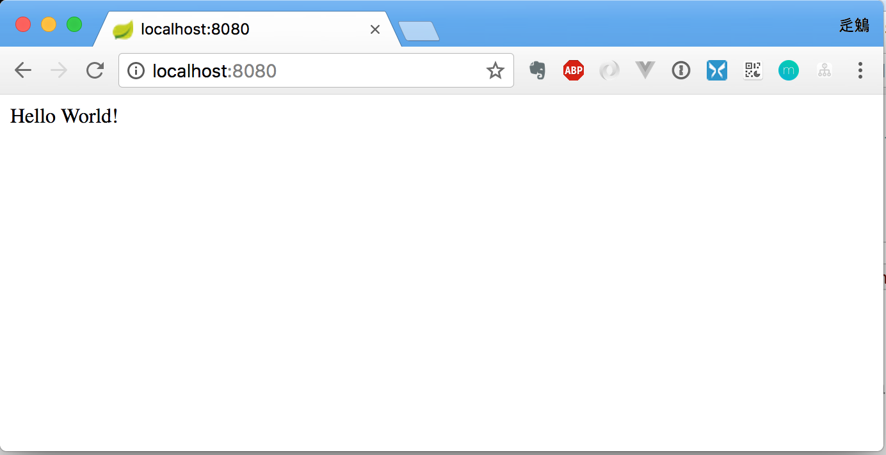

# Spring boot 是什么 ?

简单说, spring boot 是一个构建项目的工具, 一个脚手架.

# Spring boot 能干什么?

spring boot 做非常少的配置就可以构建生产级别的单体应用.

# Spring boot 怎么干的?

下面让我们来用spring boot 做一个hello world.

1. 环境准备, 需要保证你的机器上已经有了如下软件

	* JDK1.8+
	* gradle4+

2. 创建项目目录, 假设这个新的项目叫`apple`.

	``` bash
	$ cd /tmp
	$ mkdir apple
	```
	
3. 创建gradle配置文件,在这个目录下创建`build.gradle`文件.

	```bash
	$ cd apple
	$ vi build.gradle
	```
	
	将如下代码复制到`build.gradle`文件中.

	```
	plugins {
		id 'org.springframework.boot' version '2.0.1.RELEASE'
	}
	
	apply plugin: 'java'
	apply plugin: 'io.spring.dependency-management'
	
	repositories {
	    mavenCentral()
	}
	
	dependencies {
		compile 'org.springframework.boot:spring-boot-starter-web'
		testCompile 'org.springframework.boot:spring-boot-starter-test'
		testCompile 'org.springframework.boot:spring-boot-starter-webflux'
	}
	
	bootRun {
		main = 'com.thoughtworks.apple.Launcher'
	}
	```

4. 写一个Hello world.

	* 按照如下目录结构初始化项目内容

	```
	apple
	  \-src
	     \-main
	       \-java
	          \-com.thoughtworks.apple
	              |-controller
	              |   \-HomeController.java
	              \-Launcher.java              
	```

	* HomeController.java内容如下
	
	```
	package com.thoughtworks.apple.controller;

	import org.springframework.web.bind.annotation.RequestMapping;
	import org.springframework.web.bind.annotation.RestController;
	
	@RestController
	public class HomeController {
	    @RequestMapping("/")
	    String home() {
	        return "Hello World!";
	    }
	}

	```
	
	* Launcher.java内容如下

	```
	package com.thoughtworks.apple;

	import org.springframework.boot.SpringApplication;
	import org.springframework.boot.SpringBootConfiguration;
	import org.springframework.boot.autoconfigure.EnableAutoConfiguration;
	import org.springframework.context.annotation.ComponentScan;
	
	@SpringBootConfiguration
	@EnableAutoConfiguration
	@ComponentScan("com.thoughtworks.apple")
	public class Launcher {
	    public static void main(String[] args) {
	        SpringApplication.run(Launcher.class, args);
	    }
	}

	```

5. 运行

	执行命令`gradle bootRun`启动应用,之后会打印如下日志:

	```
	$ gradle bootRun
	
	> Task :bootRun
	
	  .   ____          _            __ _ _
	 /\\ / ___'_ __ _ _(_)_ __  __ _ \ \ \ \
	( ( )\___ | '_ | '_| | '_ \/ _` | \ \ \ \
	 \\/  ___)| |_)| | | | | || (_| |  ) ) ) )
	  '  |____| .__|_| |_|_| |_\__, | / / / /
	 =========|_|==============|___/=/_/_/_/
	 :: Spring Boot ::        (v2.0.1.RELEASE)
	
	2018-05-05 10:23:41.383  INFO 38941 --- [           main] com.thoughtworks.apple.Launcher          : Starting Launcher on CNyfqi.local with PID 38941 (/private/tmp/apple/build/classes/java/main started by yfqi in /private/tmp/apple)
	2018-05-05 10:23:41.386  INFO 38941 --- [           main] com.thoughtworks.apple.Launcher          : No active profile set, falling back to default profiles: default
	2018-05-05 10:23:41.432  INFO 38941 --- [           main] ConfigServletWebServerApplicationContext : Refreshing org.springframework.boot.web.servlet.context.AnnotationConfigServletWebServerApplicationContext@3b2c72c2: startup date [Sat May 05 10:23:41 CST 2018]; root of context hierarchy
	2018-05-05 10:23:42.289  INFO 38941 --- [           main] o.s.b.w.embedded.tomcat.TomcatWebServer  : Tomcat initialized with port(s): 8080 (http)
	2018-05-05 10:23:42.313  INFO 38941 --- [           main] o.apache.catalina.core.StandardService   : Starting service [Tomcat]
	2018-05-05 10:23:42.313  INFO 38941 --- [           main] org.apache.catalina.core.StandardEngine  : Starting Servlet Engine: Apache Tomcat/8.5.29
	2018-05-05 10:23:42.323  INFO 38941 --- [ost-startStop-1] o.a.catalina.core.AprLifecycleListener   : The APR based Apache Tomcat Native library which allows optimal performance in production environments was not found on the java.library.path: [/Users/yfqi/Library/Java/Extensions:/Library/Java/Extensions:/Network/Library/Java/Extensions:/System/Library/Java/Extensions:/usr/lib/java:.]
	2018-05-05 10:23:42.402  INFO 38941 --- [ost-startStop-1] o.a.c.c.C.[Tomcat].[localhost].[/]       : Initializing Spring embedded WebApplicationContext
	2018-05-05 10:23:42.403  INFO 38941 --- [ost-startStop-1] o.s.web.context.ContextLoader            : Root WebApplicationContext: initialization completed in 973 ms
	2018-05-05 10:23:42.522  INFO 38941 --- [ost-startStop-1] o.s.b.w.servlet.ServletRegistrationBean  : Servlet dispatcherServlet mapped to [/]
	2018-05-05 10:23:42.525  INFO 38941 --- [ost-startStop-1] o.s.b.w.servlet.FilterRegistrationBean   : Mapping filter: 'characterEncodingFilter' to: [/*]
	2018-05-05 10:23:42.526  INFO 38941 --- [ost-startStop-1] o.s.b.w.servlet.FilterRegistrationBean   : Mapping filter: 'hiddenHttpMethodFilter' to: [/*]
	2018-05-05 10:23:42.526  INFO 38941 --- [ost-startStop-1] o.s.b.w.servlet.FilterRegistrationBean   : Mapping filter: 'httpPutFormContentFilter' to: [/*]
	2018-05-05 10:23:42.526  INFO 38941 --- [ost-startStop-1] o.s.b.w.servlet.FilterRegistrationBean   : Mapping filter: 'requestContextFilter' to: [/*]
	2018-05-05 10:23:42.627  INFO 38941 --- [           main] o.s.w.s.handler.SimpleUrlHandlerMapping  : Mapped URL path [/**/favicon.ico] onto handler of type [class org.springframework.web.servlet.resource.ResourceHttpRequestHandler]
	2018-05-05 10:23:42.809  INFO 38941 --- [           main] s.w.s.m.m.a.RequestMappingHandlerAdapter : Looking for @ControllerAdvice: org.springframework.boot.web.servlet.context.AnnotationConfigServletWebServerApplicationContext@3b2c72c2: startup date [Sat May 05 10:23:41 CST 2018]; root of context hierarchy
	2018-05-05 10:23:42.878  INFO 38941 --- [           main] s.w.s.m.m.a.RequestMappingHandlerMapping : Mapped "{[/]}" onto java.lang.String com.thoughtworks.apple.controller.HomeController.home()
	2018-05-05 10:23:42.884  INFO 38941 --- [           main] s.w.s.m.m.a.RequestMappingHandlerMapping : Mapped "{[/error]}" onto public org.springframework.http.ResponseEntity<java.util.Map<java.lang.String, java.lang.Object>> org.springframework.boot.autoconfigure.web.servlet.error.BasicErrorController.error(javax.servlet.http.HttpServletRequest)
	2018-05-05 10:23:42.885  INFO 38941 --- [           main] s.w.s.m.m.a.RequestMappingHandlerMapping : Mapped "{[/error],produces=[text/html]}" onto public org.springframework.web.servlet.ModelAndView org.springframework.boot.autoconfigure.web.servlet.error.BasicErrorController.errorHtml(javax.servlet.http.HttpServletRequest,javax.servlet.http.HttpServletResponse)
	2018-05-05 10:23:42.910  INFO 38941 --- [           main] o.s.w.s.handler.SimpleUrlHandlerMapping  : Mapped URL path [/webjars/**] onto handler of type [class org.springframework.web.servlet.resource.ResourceHttpRequestHandler]
	2018-05-05 10:23:42.910  INFO 38941 --- [           main] o.s.w.s.handler.SimpleUrlHandlerMapping  : Mapped URL path [/**] onto handler of type [class org.springframework.web.servlet.resource.ResourceHttpRequestHandler]
	2018-05-05 10:23:43.048  INFO 38941 --- [           main] o.s.j.e.a.AnnotationMBeanExporter        : Registering beans for JMX exposure on startup
	2018-05-05 10:23:43.100  INFO 38941 --- [           main] o.s.b.w.embedded.tomcat.TomcatWebServer  : Tomcat started on port(s): 8080 (http) with context path ''
	2018-05-05 10:23:43.105  INFO 38941 --- [           main] com.thoughtworks.apple.Launcher          : Started Launcher in 2.148 seconds (JVM running for 2.523)
	2018-05-05 10:24:03.416  INFO 38941 --- [nio-8080-exec-1] o.a.c.c.C.[Tomcat].[localhost].[/]       : Initializing Spring FrameworkServlet 'dispatcherServlet'
	2018-05-05 10:24:03.416  INFO 38941 --- [nio-8080-exec-1] o.s.web.servlet.DispatcherServlet        : FrameworkServlet 'dispatcherServlet': initialization started
	2018-05-05 10:24:03.436  INFO 38941 --- [nio-8080-exec-1] o.s.web.servlet.DispatcherServlet        : FrameworkServlet 'dispatcherServlet': initialization completed in 20 ms
	<=========----> 75% EXECUTING [1m 28s]
	> :bootRun
	```
	
	之后在浏览器中访问`http://localhost:8080/` 能看到如下页面说明程序运行成功了.
	

	
# 进阶

## 如何将gradle命令引入项目

当我们本地有多个项目, 且每个项目的gradle版本不一样时, 我们就需要把gradle命令保存在项目内, 然后每个项目用自己的gradle来构建. 下面这个命令可以直接初始化引入一个gradle命令到项目内部.

```
$ gradle wrapper --gradle-version 4.0
```

之后项目目录下会多出四个文件

```
drwxr-xr-x   4 yfqi  wheel   128 May  5 10:49 .gradle
drwxr-xr-x   3 yfqi  wheel    96 May  5 10:49 gradle
-rwxr-xr-x   1 yfqi  wheel  5296 May  5 10:49 gradlew
-rw-r--r--   1 yfqi  wheel  2260 May  5 10:49 gradlew.bat
```

以后就可以在项目根目录下执行 `./gradlew`来运行gradle的tasks了.

## 测试Hello World

程序成功运行了, 让我们来写一个测试用例测试一下hello world.

* 测试目录结构如下

	```
	apple
	  \-src
	     |-main   
	     \-test
	        \-java
	            \-com.thoughtworks.apple.controller
	               \-HomeControllerTest.java       
	```

* HomeControllerTest.java内容如下

	```
	package com.thoughtworks.apple.controller;

	import org.junit.Test;
	import org.junit.runner.RunWith;
	import org.springframework.beans.factory.annotation.Autowired;
	import org.springframework.boot.test.context.SpringBootTest;
	import org.springframework.test.context.junit4.SpringRunner;
	import org.springframework.test.web.reactive.server.WebTestClient;
	
	@RunWith(SpringRunner.class)
	@SpringBootTest(webEnvironment = SpringBootTest.WebEnvironment.RANDOM_PORT)
	public class HomeControllerTest {
	    @Autowired
	    private WebTestClient webClient;
	
	    @Test
	    public void should_get_home() {
	        this.webClient.get().uri("/").exchange()
	                .expectStatus().isOk()
	                .expectBody(String.class).isEqualTo("Hello World!");
	    }
	}
	```

* 运行测试使用命令`./gradlew test`能看到如下日志说明测试执行成功

	```
	$ gradle test
	Starting a Gradle Daemon (subsequent builds will be faster)
	
	> Task :test
	2018-05-05 10:36:18.034  INFO 39291 --- [       Thread-6] ConfigServletWebServerApplicationContext : Closing org.springframework.boot.web.servlet.context.AnnotationConfigServletWebServerApplicationContext@918accb: startup date [Sat May 05 10:36:15 CST 2018]; root of context hierarchy
	
	
	BUILD SUCCESSFUL in 12s
	3 actionable tasks: 3 executed
	```
	
## 打包部署

1. 执行命令`./grdlew bootJar`来打包spring boot项目. 命令执行成功后会在`apple/build/libs`下多出一个jar包`apple.jar`.这就打包成功了.
2. 把打包好的jar包复制到运行的服务器, 执行命令`java -jar apple.jar &`就可以把应用启动起来.
	
## Spring Boot Starters

上面的例子大家会发现项目只是依赖了三个Spring Boot的Starter就完成了对所有第三方jar包的引用.Starter其实就是对第三方jar包依赖按照业务需要做了一个聚合,Spring Boot提供了大量的Starter来帮助开发人员快速开始构建项目, 降低了开发人员调包依赖的工作量.在这两个地址可以查看Spring Boot的所有的Starters. 

* <https://docs.spring.io/spring-boot/docs/current-SNAPSHOT/reference/htmlsingle/#using-boot-starter> 
* <https://github.com/spring-projects/spring-boot/tree/master/spring-boot-project/spring-boot-starters>

## 源码

文章的完整代码可以在这里找到: <https://github.com/qyf404/learning-spring-boot>

作者:[辵鵵](https://about.me/qyf404)


